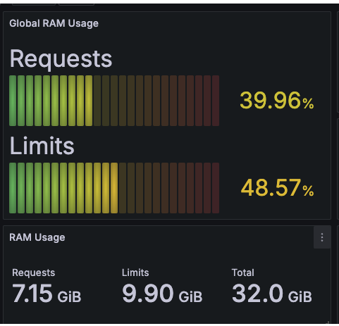

# K8S Shutdown 후 재실행 작업 메모

## 목차

- [소개 - 작업 내용](#소개-작업-내용)
- [결론 - 인사이트](#결론-인사이트)
- [결과](#결과)
  - [ESXi 호스트 램 추가: 32GB -> 64GB](#esxi-호스트-램-추가-32gb---64gb)
  - [K8S 클러스터 램 추가: 20GB -> 32GB](#k8s-클러스터-램-추가-20gb---32gb)
  - [K8S 운영 중인 파드 정상화 (Invalid, Crash 제거)](#k8s-운영-중인-파드-정상화-invalid-crash-제거)
- [작업 내용](#작업-내용)
  - [ETCD 백업](#etcd-백업)
  - [Pod Replica 0으로 수정](#pod-replica-0으로-수정)
  - [ArgoCD Pod Replica 0으로 수정](#argocd-pod-replica-0으로-수정)
  - [Static Pod 다시 켜기](#static-pod-다시-켜기)
  - [그 외 Deployment 재실행하기](#그-외-deployment-재실행하기)

---

## 소개 - 작업 내용

ESXi에 램을 증설과정 중 있던 K8S 작업에 대해 다룹니다.

호스트 자체를 부팅해야 해서 K8S의 모든 노드가 일시적으로 종료됩니다. 모든 데이터 노드와 Control Plane의 VM을 일시에 껐다 켠 후, K8S의 파드를 정상 상태로 복구하는 과정에 대해 다룹니다.

---

## 결론 - 인사이트

1. ETCD는 백업해두세요.

2. 가능하다면 운영 중인 파드들의 Replica Count를 0으로 만든 후 노드를 종료하세요.

3. 가능하다면 Graceful 하게 종료하고 하나의 노드씩 작업하세요. 모든 노드, 특히 Control Plane을 전부 Shutdown 하는 일은 없도록 하세요.

4. 그래도 전부 꺼야 한다면 시간의 여유가 있을 때 작업하세요. 몇몇 Static Pod들이 정상 동작하기까지 시간이 필요합니다.

---

## 결과

### ESXi 호스트 램 추가: 32GB -> 64GB


### K8S 클러스터 램 추가: 20GB -> 32GB


### K8S 운영 중인 파드 정상화 (Invalid, Crash 제거)


## 작업 내용

### ETCD 백업

아래 내용 중 복구는 꼭 수행해야 하는 것은 아닙니다. 저도 백업만 만들고 복구는 안 했습니다.

다만 K8S의 상태 값을 파일로 관리하는 부분이라 만에 하나 유실되거나 오염된다면 이후의 K8S를 정상으로 되돌릴 방법이 없을 수도 있습니다.

유실과 오염에 대응하는 유일한 방법은 백업 후 복구이므로, K8S 건강 상태에 자신이 있어도 안전하게 백업 이후에 작업하시길 바랍니다.

[K8S 공식 문서 ETCD 백업 커맨드는 Backing up an etcd cluster부터 보세요](https://kubernetes.io/docs/tasks/administer-cluster/configure-upgrade-etcd/)

**백업하기**

```sh
ETCDCTL_API=3 etcdctl --endpoints=https://127.0.0.1:2379 \
  --cacert=<trusted-ca-file> --cert=<cert-file> --key=<key-file> \
  snapshot save <backup-file-location>
```

**복구하기**

```sh
etcdutl --data-dir <data-dir-location> snapshot restore snapshot.db
```

<br/>

### Pod Replica 0으로 수정

Replica를 0으로 만드는 것은 실행 중인 Deployment를 안전하게 중지하는 방법 중 하나입니다.

특히, ArgoCD, Prometheus 등 상태를 가지고 있는 애플리케이션은 미리 Replica Count를 0으로 두는 것을 추천합니다.

**ArgoCD를 통한 조정**

배포된 웹 애플리케이션을 ArgoCD를 통해 중지할 수 있습니다.


**Manifest를 통한 조정**

운영 중인 DB는 직접 Manifest를 조정해서 중지해주세요.

```yaml
# 예시 1
apiVersion: apps/v1
kind: StatefulSet
metadata:
  name: elasticsearch
  namespace: prod-es
spec:
  serviceName: elasticsearch
  replicas: 0

...

kubectl apply -f elasticsearch_custom.yml
```

```yaml
# 예시 2
apiVersion: apps/v1
kind: StatefulSet
metadata:
  name: develop-mysql
  namespace: develop-mysql
spec:
  replicas: 0
  ..

kubectl apply -f develop_mysql.yaml
```

<br/>

### ArgoCD Pod Replica 0으로 수정

**정지 스크립트**

```sh
#!/bin/bash

# Namespace
NAMESPACE="devwiki-manage"

# Deployments and StatefulSets to scale down
# kubectl get all -n devwiki-manage 의 결과를 넣은 것입니다. 각자의 환경에 맞게 변수를 바꾸세요.
DEPLOYMENTS=(
  "argo-release-1-argocd-applicationset-controller"
  "argo-release-1-argocd-dex-server"
  "argo-release-1-argocd-notifications-controller"
  "argo-release-1-argocd-redis"
  "argo-release-1-argocd-repo-server"
  "argo-release-1-argocd-server"
)

STATEFULSETS=(
  "argo-release-1-argocd-application-controller"
)

# Scale down
echo "Scaling down Deployments and StatefulSets..."

for DEPLOYMENT in "${DEPLOYMENTS[@]}"; do
  kubectl scale deployment $DEPLOYMENT --replicas=0 -n $NAMESPACE
done

for STATEFULSET in "${STATEFULSETS[@]}"; do
  kubectl scale statefulset $STATEFULSET --replicas=0 -n $NAMESPACE
done

echo "Waiting for all pods to terminate..."
sleep 30 # Adjust the sleep time if needed

# Verify scale down
kubectl get pods -n $NAMESPACE

echo "Scale down complete."
```

**시작 스크립트**

```sh
#!/bin/bash

# Namespace
NAMESPACE="devwiki-manage"

# Deployments and StatefulSets to scale up
# kubectl get all -n devwiki-manage 의 결과를 넣은 것입니다. 각자의 환경에 맞게 변수를 바꾸세요.
DEPLOYMENTS=(
  "argo-release-1-argocd-applicationset-controller"
  "argo-release-1-argocd-dex-server"
  "argo-release-1-argocd-notifications-controller"
  "argo-release-1-argocd-redis"
  "argo-release-1-argocd-repo-server"
  "argo-release-1-argocd-server"
)

STATEFULSETS=(
  "argo-release-1-argocd-application-controller"
)

# Scale up
echo "Scaling up Deployments and StatefulSets..."

for DEPLOYMENT in "${DEPLOYMENTS[@]}"; do
  kubectl scale deployment $DEPLOYMENT --replicas=1 -n $NAMESPACE
done

for STATEFULSET in "${STATEFULSETS[@]}"; do
  kubectl scale statefulset $STATEFULSET --replicas=1 -n $NAMESPACE
done

echo "Waiting for all pods to start..."
sleep 60 # Adjust the sleep time if needed

# Verify scale up
kubectl get pods -n $NAMESPACE

echo "Scale up complete."
```

### Static Pod 다시 켜기

Kube-system의 몇몇 파드들은 Deployment에 의해 관리되지 않습니다.

재부팅 후, Kube-system의 파드가 **"INVALID"** 상태라면 아래처럼 해당 리소스의 Manifest의 수정 시간을 변경해주세요.

시간이 지나면 재실행됩니다.

```sh
sudo touch /etc/kubernetes/manifests/kube-apiserver.yaml
```

### 그 외 Deployment 재실행하기

그 외에도 Invalid 상태의 Pod가 있다면 Deployment를 재실행해주세요.

아래는 예시입니다.

```sh
# Prometheus
kubectl rollout status deployment prometheus-kube-state-metrics -n prometheus
kubectl rollout status deployment prometheus-prometheus-pushgateway -n prometheus
kubectl rollout status deployment prometheus-server -n prometheus

# Grafana
kubectl rollout restart -n grafana deployment.apps/grafana

# NGINX
kubectl rollout restart deployment ingress-nginx-controller -n ingress-nginx

# 그 외 상황에 맞춰서 ...
```
